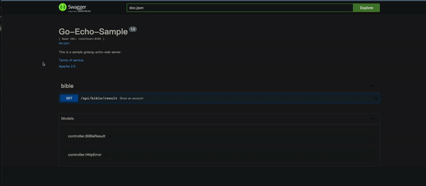

# UFES-TFAP-TEST

Make an out-of-the-box backend based on golang-echo

```bash
Echo + MySQL + go-resty + Gorm + ZAP +configor
```

### Project screen shoot


```bash
http://localhost:8080/swagger
```
### Tree view

```bash
.
├── Dockerfile
├── LICENSE
├── README.md
├── application.yml
├── controller
│   ├── bible.go
│   ├── models.go
│   └── resp.go
├── docker
│   ├── build.sh
│   └── run.sh
├── docs
│   ├── docs.go
│   ├── swagger.json
│   └── swagger.yaml
├── go.mod
├── go.sum
├── main.go
├── models
├── router
│   ├── bible.go
│   ├── router.go
│   └── url.go
├── sample.gif
└── utils
    ├── config
    │   └── config.go
    ├── logger
    │   └── logger.go
    ├── middlewares
    │   ├── error.go
    │   ├── initMiddleware.go
    │   └── wrapper.go
    └── util.go

```

## Docker

### how to build

```bash
make build
```

### how to run

```bash
make test
```

## References

- [https://gorm.io/](https://gorm.io/)
- [https://echo.labstack.com/](https://echo.labstack.com/)
- [https://github.com/uber-go/zap](https://github.com/uber-go/zap)
- [https://github.com/jinzhu/configor](https://github.com/jinzhu/configor)
- [https://github.com/go-resty/resty](https://github.com/go-resty/resty)
- [https://github.com/swaggo/swag#declarative-comments-format](https://github.com/swaggo/swag#declarative-comments-format)
- [https://github.com/ybkuroki/go-webapp-sample](https://github.com/ybkuroki/go-webapp-sample)
- [https://github.com/brpaz/echozap](https://github.com/brpaz/echozap)
- [https://github.com/sandipb/zap-examples](https://github.com/sandipb/zap-examples)


